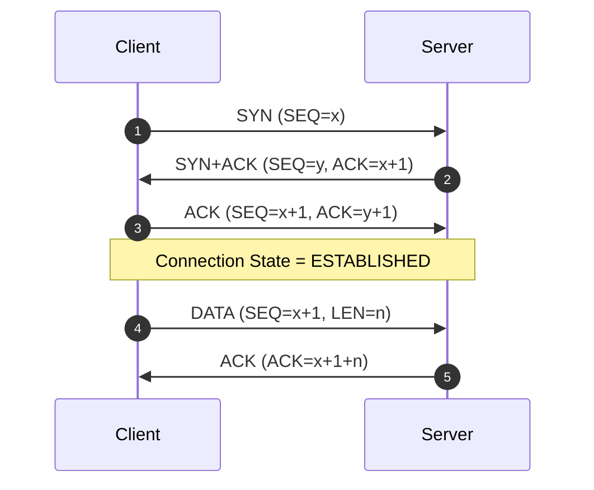
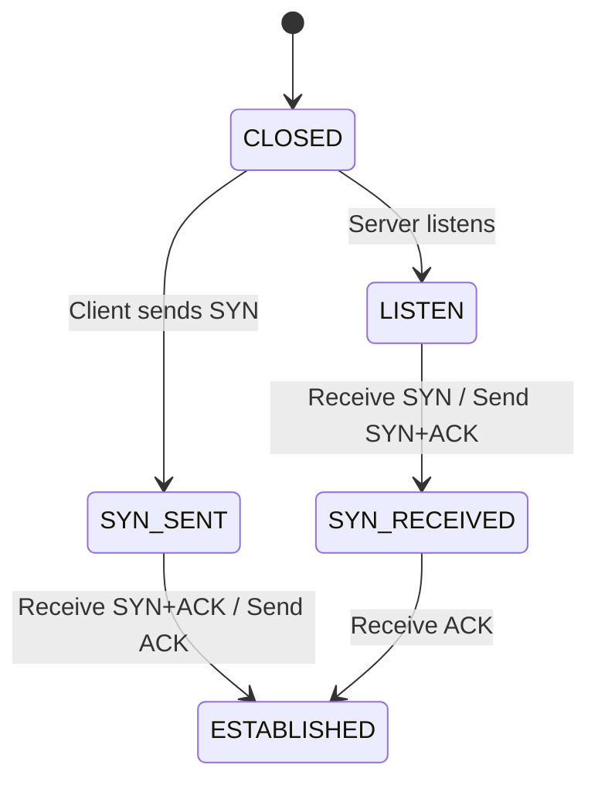

## 개념 정의
TCP 3-way handshake는 데이터 전송 전에 양쪽 호스트가 통신 준비 상태를 맞추는 연결 수립 절차이다.  
핵심 목적은 단순 인사 과정이 아니라 양측의 초기 시퀀스 번호(ISN)를 동기화하고, 서로가 송수신 가능한 상태임을 확인하는 것이다.  
TCP는 전송 계층(OSI 4계층) 프로토콜이므로 HTTP, WebSocket, SSE 같은 애플리케이션 프로토콜은 이 연결 위에서 동작한다.  
즉 브라우저가 `https`나 `wss`를 호출할 때도 실제 네트워크에서는 먼저 TCP handshake가 실행된 뒤에 TLS/HTTP 단계가 이어지는 구조이다.

## 동작 원리
1. 클라이언트가 서버의 IP/Port를 대상으로 `SYN=1, SEQ=x` 패킷을 전송하며 연결 시작 의사를 보낸다.  
2. 서버는 이를 받으면 `SYN=1, ACK=1, SEQ=y, ACK=x+1`로 응답하며 자신의 시작 시퀀스 번호를 제시하고, 클라이언트 SYN 수신을 확인한다.  
3. 클라이언트는 `ACK=1, SEQ=x+1, ACK=y+1`를 전송해 서버 SYN 수신을 확인하고, 양측 상태가 `ESTABLISHED`로 전이된다.  
4. 연결 성립 후부터는 데이터 바이트 스트림이 시퀀스 번호 기준으로 전송되며, ACK는 다음에 기대하는 바이트 번호를 지속적으로 알려준다.  
5. 이 구조 덕분에 TCP는 순서 보장, 유실 감지, 재전송, 중복 제거를 구현할 수 있다.

여기서 중요한 포인트는 `+1`의 의미이다.

- SYN 플래그 자체가 시퀀스 공간에서 1을 소비하므로 상대의 ACK는 `SEQ + 1`이 된다.  
- 데이터 100바이트를 보냈다면 ACK는 보통 `현재 SEQ + 100`으로 이동한다.  
- 초기 시퀀스 번호를 랜덤에 가깝게 선택하는 이유는 예측 가능한 연결 하이재킹 위험을 줄이기 위함이다.

2-way가 아니라 3-way가 필요한 이유도 상태 동기화 관점에서 설명된다.

- 2-way면 서버는 응답을 보낸 뒤 연결 준비 상태라고 착각할 수 있다.  
- 마지막 ACK가 있어야 서버는 클라이언트가 자신의 SYN-ACK를 실제로 수신했음을 확정할 수 있다.  
- 결국 3-way handshake는 두 노드의 연결 상태를 대칭으로 맞추기 위한 최소 절차라는 점이 핵심이라는 것을 이해하게 된다.

## 코드




```text
Client                                    Server
SYN, SEQ=1000 --------------------------> 
                     <------------------- SYN+ACK, SEQ=5000, ACK=1001
ACK, SEQ=1001, ACK=5001 ---------------->

State: ESTABLISHED
```

위 시퀀스 다이어그램은 실제 패킷 교환 순서를 보여주는 실행 흐름이다.  
위 상태 다이어그램은 커널 TCP 상태머신이 어떤 이벤트로 전이되는지 보여주는 운영체제 관점의 흐름이다.  
브라우저/Node.js/모바일 앱에서 연결을 열 때 이 절차는 애플리케이션 코드 아래에서 자동으로 실행되며, 개발자는 결과적으로 연결 지연 시간과 실패 패턴으로 이를 관찰하게 된다.

## 언제 쓰는지
- `첫 요청이 유독 느린` 현상을 분석할 때 DNS, TCP, TLS 중 어디서 지연이 생기는지 분리해 볼 때 유용하다.  
- WebSocket pending, API timeout, 간헐적 연결 실패를 볼 때 ALB/Nginx/방화벽/서버 중 어느 구간에서 handshake가 끊기는지 추적할 때 필요하다.  
- 프론트엔드에서 성능 최적화(keep-alive, connection reuse, preconnect)를 판단할 때 기초 모델로 반드시 필요하다.  
- 다만 애플리케이션 버그를 모두 네트워크 문제로 단정하기 전에 HTTP 레벨 에러와 비즈니스 로직 에러를 먼저 분리하는 습관이 필요하다.

## 핵심 한 줄
TCP 3-way handshake는 단순 연결 인사가 아니라 양측 시퀀스 번호를 동기화하고 상태를 대칭으로 확정해 신뢰성 전송을 시작하는 최소 절차이다.
