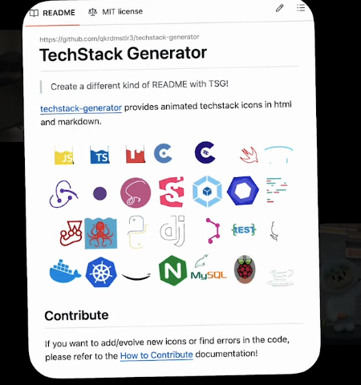
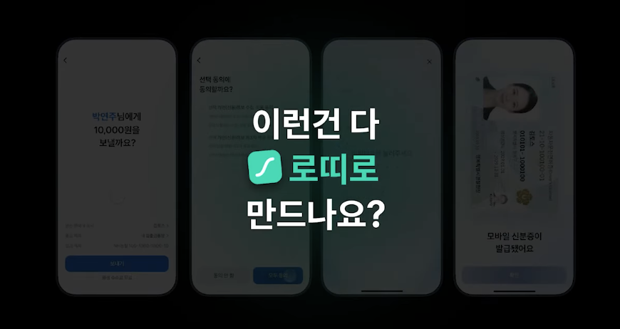
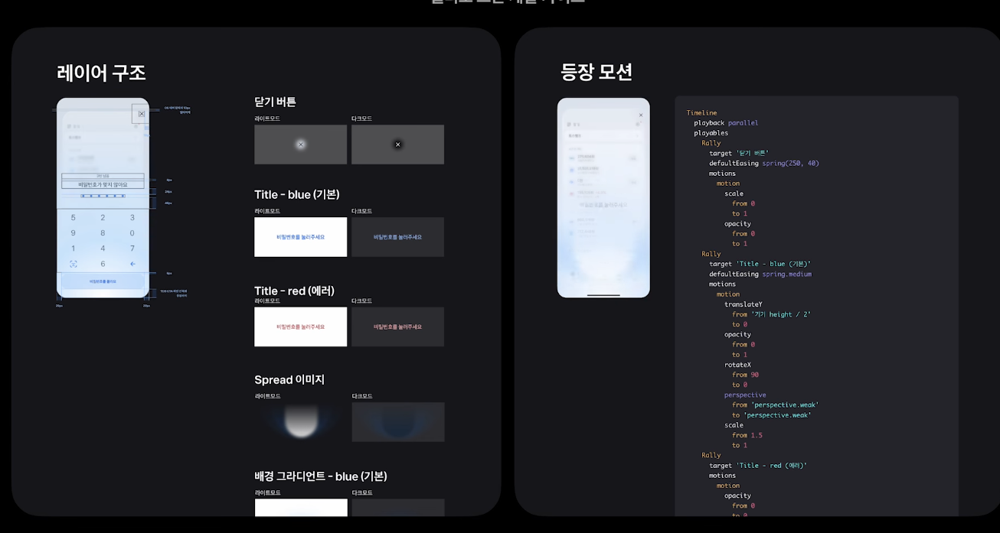
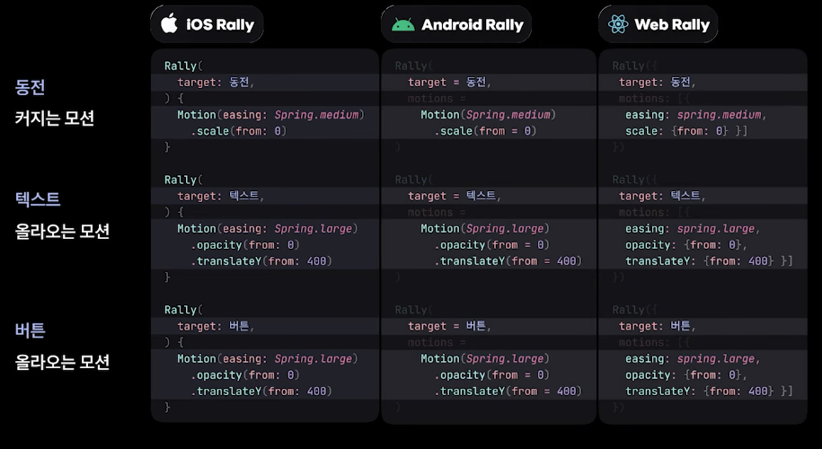
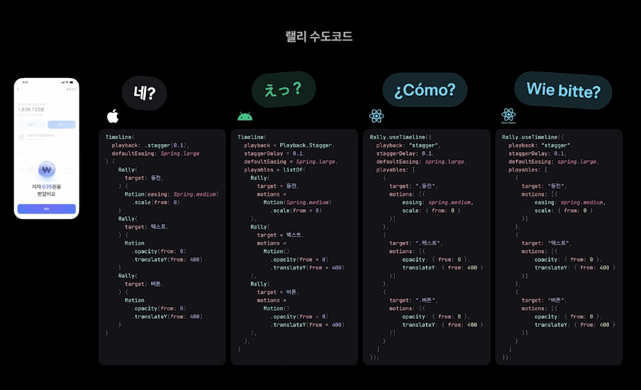
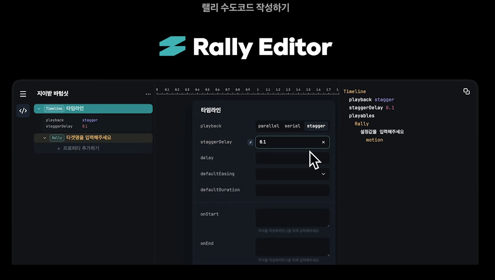
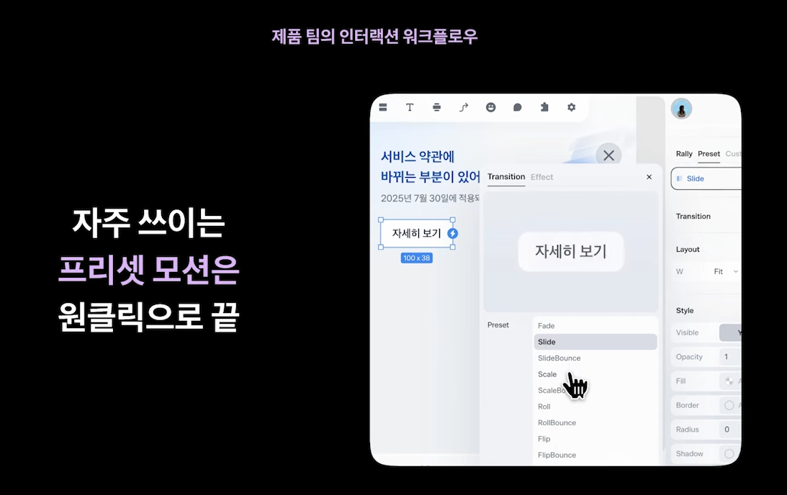
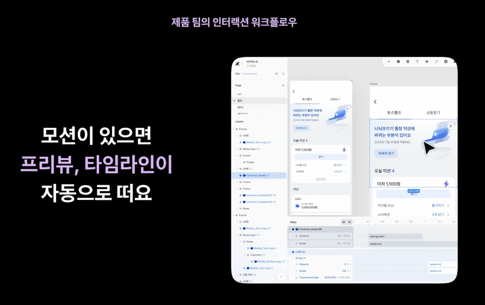
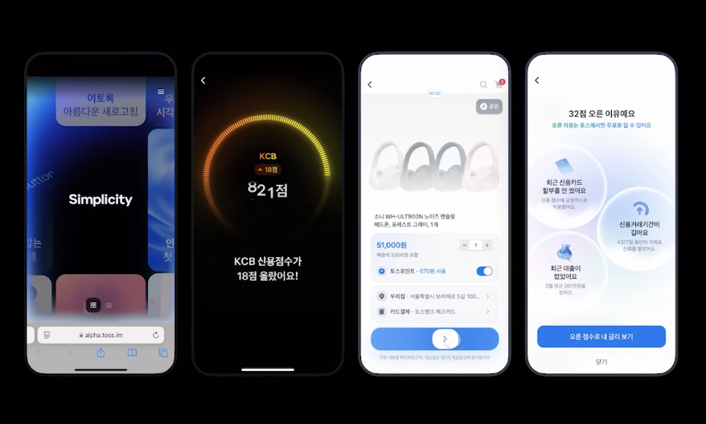
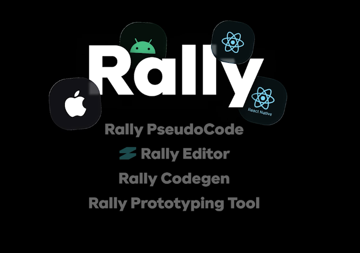

# TMC25 | Design - 인터랙션, 토스에선 어떻게 개발하나요?

### part 1

토스 인터랙션 팀의 **인터랙션 디자이너와 개발자, 어떻게 소통할까?**

- **techStack Generator**

  각 svg 로고 모션들을 코드로 만들어봤었다고 함

  이걸 어캐하셨지? 흥미로운 포트폴리오다 눈이 떠지게 만드는

로띠로 적용하기에는 UI에 적용되는 모션이 많아서 **로띠**로 개발할 순 없다.

다크모드 또는 해상도 160%가 되는 경우로 많은 경우가 나뉘기 때문에 로띠로 불가

---

### 🔵 Part. 1 인터랙션 팀의 개발 가이드 작성법

**Rally**

인터랙션 디자이너가 Rally로 가이드를 작성한다 !

**오른쪽의 긴 코드가 Rally : 애니메이션 수도 코드 느낌인듯**

> **Rally를 만든 이유**
>
1. **첫번째 시도**
    1. 레퍼런스 영상 드리기
    - 실제 개발자는 해당 영상에서 어디서부터 어디까지 똑같이 만들어달라는 것인지 범위가 추상적이기 때문에 가혹했다

    💡경험담
    실제 양띵에서 작업할 때, 내가 일러스트를 그리고 영상편집자한테 편집 시나리오를 드릴때 내가 원하는 만큼의 편집 시나리오를 보여주기 위해서 내가 직접 PPT로 애니메이션을 만들어서 드렸을 때가 있었다. → 이정도로 하지 않으면 내가 어떻게 구상했는지 50%로도 전달이 되지 않았기 때문.
    → 이런 생각을 하면 Rally는 좋은 시스템인것 같다.

1. **두번째 시도**
    1. 샘플 코드 드리기
    2. 직접 디자이너가 AI를 작성해서 모션에 집중한 코드를 작성해서 드렸던 것 같다.
    - 개발자 입장에서는 더 헷갈리고 코드 가독성도 안좋아서 복붙할수도 없어서 일이 이중으로 늘어난 기분이었다.
    - 거의 다 처음부터 다시 코드를 작성했다고 함….

**→ 결국 모션 소통 언어[Rally]를 만들게 됨.**

---

### 첫번째 고난
웹과 ios는 반복횟수를 다르게 생각한다.

**예시 : 2번 뜨는 애니메이션**

-  웹에서 반복 **한번** 해주세요! —> 기존 default(1) + **1** = 2번이지만

- ios에서 반복 **한번** 해주세요! —> for(i=0;i<**1**;i++) = 1번

으로 적용되기 때문에 동작 방식이 달랐다.

**> 해결방안**
- 반복횟수(repeatCount) → **재생횟수(playCount)**
`playCount : 2`

---

> **Rally 컴포넌트**
>

**" 클린 코드의 철학인 다른 사람이 봐도 쉽게 알수 있도록 작성되어야 한다"가 적용되어 있다**

---

> Timeline
>

**Timeline.Parallel** → 동시에 동작  
**Timeline.serial** → 순차적 동작  
**Timeline.Stagger(0.1s)**

**각 플랫폼마다 사용되는 메서드가 다르기 때문에,**

---

> 공통 언어인 **랠리 수도 코드**를 만들게 됨.
>

이 랠리 수도 코드를 하나만들어두면 **인스펙터**를 통해 각 플랫폼에서 사용가능한 코드를 코드Gen까지 연동되어잇다.

→ 근데 이걸 옛날에는 하나하나 작성했었는데, 오타가 있으면 코드젠이 안된다..!

해서 등장한 **Rally Editor**

인터렉션 디자이너가 편하게 애니메이션을 추가하고 삭제할 수 있도록 에디터를 만들었다고함..!

****

---

### 인터렉션 팀의 개발 워크 플로우

    💡   프로토타입 → 수도코드 작성(에디터) → 개발자가 랠리 코드젠 확인

## 모션 있는 화면은 모두 다 이 과정을 거치나?

> 아니요!

더 단축할 수 있음

→ 자주 쓰이는 프리셋 모션은 에디터에서 관할

이런 툴은 **토스가 만든 자체 디자인 에디터 Deus** 를 개발자가 만들었다고..?

피그마가 애니메이션은 약해서 **Deus**를 새로 만들었다고 함.
이전에는 Framer 채용

> 💡 경험담
>   - Framer 실제로 썼었음!
>   - 디자인과 함께하는 프로젝트였는데 디자이너가 autolayer 에 대한 개념이 없으셔서 내가 직접 framer에 있는 기능들을 사용해서 웹을 만들었다는 사실…!

---

### 토스 인터랙션 팀은 왜 이렇게 까지 워크 플로우에 집착하는 걸까요?

더 많은 인터랙션을 넣고 싶기 때문!

**개발자가 인터랙션을 더 정확하게 빠르게 구현할수있도록**

**그만큼 진심이시다…. 나 약간 무서다...하지만 더 탐나는 자리인것 같다**

---

### 회고
해당 영상을 통해 인터랙션 개발자가 어떤 방식으로 작업하고, 코드를 구성하는지 조금 더 명확하게 이해할 수 있었다.

1. 먼저 코드 구조가 매우 모듈화되어 있어, 외부인이 보더라도 함수의 역할이 명확하게 드러나는 점이 인상 깊었다. 디자이너조차 흐름을 이해할 수 있을 정도로 리팩토링이 잘 되어 있다는 느낌을 받았다.
2. 또한 디자이너와의 소통이 굉장히 활발한 팀이라는 생각이 들었다. 서로 높은 이해도를 맞추기 위해 ‘Rally’라는 공통 언어를 만들어 사용한다는 점이 특히 흥미로웠다.
3. 다양한 애니메이션을 효율적으로 구현하기 위해, 자체 프레임워크를 만들고 필요 시 오픈소스 라이브러리나 내부 도구를 조합해 사용하는 방식도 인상적이었다.

단순히 프로젝트를 위한 코드가 아니라, **‘스스로 계속 사용하고 발전시킬 수 있는 도구’를 만드는 경험이 중요하다는 것**을 실감했다.

최근 개인 프로젝트를 하면서 성능 최적화에 대한 이해가 부족하다고 느껴 애니메이션을 피하려 했는데, 이 영상을 다시 보니 오히려 “인터랙션을 제대로 구현해보고 싶다”는 욕심이 생겼다.

그러다 보니 자연스럽게 다음 질문이 떠올랐다.

**“인터랙션의 성능을 최적화하는 방법은 무엇일까?”**

애니메이션이 관여하는 영역은 성능 비용이 큰 만큼, 최적화를 무시할 수 없다.

다음 학습 주제는 **인터랙션 성능 최적화 방법을 탐구하는 것**으로 정했다.

> 💡 특히 이 영상에서 소개된 모듈화 방식과 워크플로우는,
>
>
> 추후 내가 인터랙션 오픈소스를 만들 때 구조화된 방향성을 잡는 데 큰 도움이 될 것 같다.
>

마지막으로,

**“박은식 개발자님… 이걸 어떻게 만드신 건가요?”**

라는 존경심과 함께,

**“나도 이런 팀에 들어가기 위해 무엇을 준비해야 할까?”**

라는 질문이 자연스럽게 남았다. . .