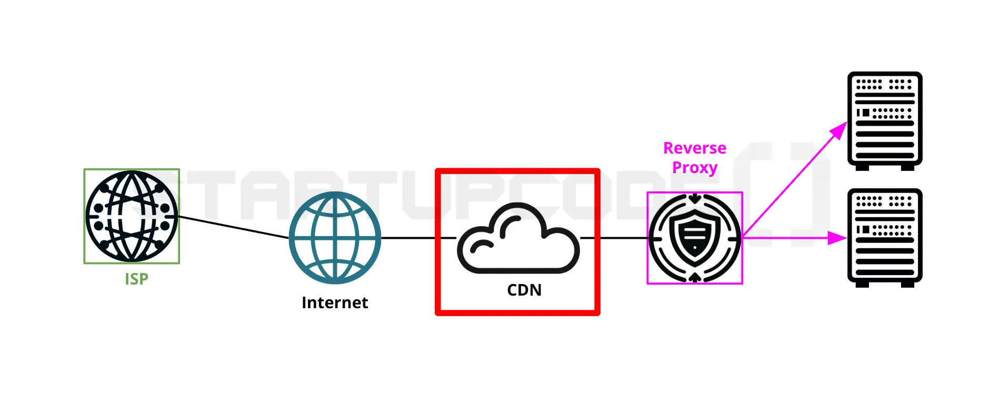

### CDN (Content Delivery Network)

사용자에게 콘텐츠를 빠르고 안전하게 전달하기 위한 서비스

**: 파일(콘텐츠)을 사용자 가까운 곳에 캐싱해서 더 빨리 주는 시스템**

- 콘텐츠 : HTML, CSS, JS 이미지 같은 정적 파일
- 네트워크 : 전세계에 퍼져있는 중간 **전달 거점들**

---

일반적으로는 웹 서비스나 앱은 모든 요청을 원본 서버(S3, EC2 등)에 요청을 해야한다.

- **인터넷 요청은 거리 영향을 받는다!**

  예를 들어

    - 💻 **서버**가 **한국**에 있음
    - **👥 사용자**가 **미국**에 있음

  요청 경로:

  미국 → 한국 → 미국

  이러면 **지연(latency)** 이 커져.

- **CDN**은 여러 지역 각지에 컨텐츠를 복사해준다.
    - 한국 서버에 있는 파일을
    - 미리 미국, 유럽, 일본 등 **여러 지역에 복사해 둠**
    - 사용자는 **가장 가까운 곳에서 받음**

---

### CDN은 개념일뿐이다.

- **CDN은 개념(아키텍처/역할)**이고, CloudFront는 개념을 실제로 구현한 서비스이다.
    - 어느 특정 제품이름이 아니고 어느 회사 고유 기술이 아님.
    - 그저 이런 역할을 하는 시스템에 붙인 이름.
- **CDN을 구현하기 위해 CloudFront를 사용한다.**
    - 즉, “ 정적 콘텐츠를 사용자와 가까운 곳에서 빠르게 전달하기 위한 분산 네트워크 구조 “
    - 이 정의에 만족하면 모두 **CDN**이다.

---

### 동작 방식

1. 사용자가 파일 요청
2. 가까운 CDN 서버에 파일 있으면 → 바로 응답
3. 없으면 → 원본 서버(S3 등)에서 가져와서 저장(캐싱) 후 응답

이 캐싱 구조 덕분에, 같은 지역에 있는 유저 두명의 경우,

한명의 유저가 해당 컨텐츠를 요청했었을 경우 다른 유저는 더 빠르게 확인할수있다.

---

### CloudFront

**CDN 네트워크 서비스**

: CDN 개념을 실제로 동작하게 만든 **구현체**

- CDN → **interface / abstract concept**
- CloudFront → **implements CDN**

  → 주의 : 표준 인터페이스 문법이 있는 것은 아님. 단지 개념을 정의한 것 뿐.

❓ CloudFront 말고로 CDN 구현체가 더 있나요?

- 있다.
    - 예 : Cloudflare CDN, Akamai CDN, Fastly CDN

<aside>

💡
S3란?
**간단하게 생각하기 : 스토리지다.**

</aside>