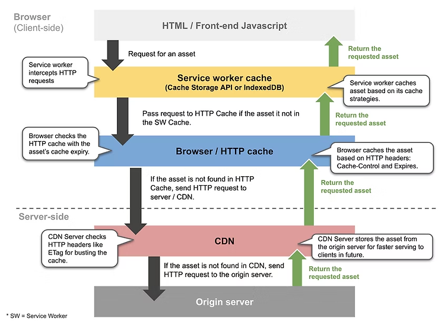

## 1. HTTP Cache (네트워크 캐시)

- **저장 위치 :** 브라우저 **디스크** (일부는 메모리)
- **메모리 캐시** : RAM에 적재
  - 메모리와 디스크 중 브라우저 내부 정책에 따름.

- **접근 주체 :** **브라우저 네트워크 레이어**
- JS 코드에서 직접 접근 불가 (브라우저 자동 제어)
  * HTTP 헤더로 정책 지시 


- **캐시 대상 :** 동일한 HTTP 요청 응답(Response)
  * HTML
  * JS / CSS
  * 이미지
  - API 응답 (조건 충족 시)


- **제어 방법 :** HTTP 헤더
    * `Cache-Control`
    * `ETag`
    * `Last-Modified`


- **특징**
  * 가장 기본적인 캐시
  * 새로고침(F5) 시 재검증
  * 강력 새로고침(Ctrl+Shift+R) 시 무시


> 브라우저가 자동으로 관리하는 네트워크 캐시

---

## 2. Memory Cache

- **저장 위치** : 브라우저 메모리(RAM)

- 접근 주체 : 브라우저 내부

- 캐시 대상
  - JS, CSS, 이미지 등
  * 현재 탭에서만 유효
  * 브라우저가 리소스에 대해 요청 확률이 높을 경우 디스크가 아닌 램에 들고있다. 

- 특징

  * 페이지 이동 시에도 재사용 가능
  * 탭 닫으면 소멸
  * 매우 빠름


> 현재 탭 생명주기 캐시

---

## 3. Disk Cache

- 저장 위치 : 브라우저 디스크
- 접근 주체 : 브라우저 내부
- 캐시 대상 : HTTP Cache와 동일

- 특징

  * 브라우저 재시작 후에도 유지
  * 용량 큼
  * Memory Cache보다 느림

> 지속형 네트워크 캐시

---

## 4. Cache Storage (Service Worker Cache)

- 저장 위치 : 브라우저 디스크

- 접근 주체 : **Service Worker** (네트워크보다 앞에 있다.)
  * 접근 방법
      ```
      요청 발생
       → Service Worker intercept
         → Cache Storage 확인
           → 있으면 바로 응답
           → 없으면 네트워크 요청
      ```
* `caches.open()` API

- 캐시 대상
  * HTML
  * JS / CSS
  * 이미지
  * API 응답 (명시적으로 저장한 것)

- 특징
  * 오프라인 지원
  * 네트워크 전략 직접 구현 가능
  * HTTP Cache와 완전히 별도

> **개발자가 제어하는 리소스 캐시**

---

## 5. Web Storage

### 5-1. LocalStorage

* 위치: 디스크
* 범위: 도메인 단위
* 수명: 영구
* 동기 API
* 보통 설정값, 토큰 저장

### 5-2. SessionStorage

* 위치: 메모리
* 범위: 탭 단위
* 수명: 탭 종료 시 삭제


> 상태 저장용 스토리지 (캐시 용도 아님)

---

## 6. IndexedDB

- 저장 위치 : 브라우저 디스크
- 접근 주체 : JS
- 캐시 대상
  * 구조화된 대용량 데이터
  * 오프라인 데이터

- 특징

  * 비동기
  * 대용량 가능
  * 복잡하지만 강력

> **앱 데이터베이스**

---

## 7. Cookie (참고)

* 위치: 디스크
* 서버 요청 시 자동 전송
* 캐시라기보단 상태 전달 수단
* 용량 작음

---

## 8. 한눈에 보는 정리표

| 구분             | 저장 위치   | 제어 주체          | 용도          |
| -------------- | ------- | -------------- | ----------- |
| HTTP Cache     | 메모리/디스크 | 브라우저           | 네트워크 최적화    |
| Memory Cache   | 메모리     | 브라우저           | 탭 단위 빠른 재사용 |
| Disk Cache     | 디스크     | 브라우저           | 지속 네트워크 캐시  |
| Cache Storage  | 디스크     | Service Worker | 앱 셸 / 오프라인  |
| LocalStorage   | 디스크     | JS             | 설정 / 상태     |
| SessionStorage | 메모리     | JS             | 임시 상태       |
| IndexedDB      | 디스크     | JS             | 대용량 데이터     |

---

## 핵심 한 줄 요약

* **HTTP / Memory / Disk Cache** → 브라우저 자동 관리
* **Cache Storage** → Service Worker가 직접 제어
* **LocalStorage / IndexedDB** → 상태 저장소이지 캐시는 아님

---

## Client-side / Server-side

### 클라이언트 사이드 (Client-side)
- **사용자 기기에서 실행되는 코드와 처리 영역**

- 실행 위치: 사용자 디바이스 (브라우저, 모바일 앱 등)

- 실행 주체: 브라우저 런타임 (V8 등)

- 대표 기술: HTML, CSS, JavaScript, React, Service Worker

- 결과물 생성: 브라우저가 DOM을 생성·갱신

### 서버 사이드 (Server-side)

- **네트워크 너머의 서버 환경**에서 실행되는 코드와 처리 영역

- 실행 위치: 서버 인프라 (Node.js, Java, Python 등)

- 실행 주체: 서버 런타임

- 대표 기술: Node.js, Next.js 서버, API 서버
- 결과물 생성: 데이터 또는 HTML을 서버에서 생성

| 기준    | 클라이언트 사이드 | 서버 사이드       |
| ----- | --------- | ------------ |
| 실행 위치 | 사용자 기기    | 서버 인프라       |
| 실행 시점 | 페이지 로드 후  | 요청 시 또는 빌드 시 |
| 생성 주체 | 브라우저      | 서버 런타임       |


### 계층 구조 
```
[ Client-side ]
  └── Browser
        ├─ JS / HTML
        ├─ Service Worker
        ├─ HTTP Cache
        └─ Network Stack
              ↓   ← 여기서부터 Network
        Internet / CDN
              ↓
[ Server-side ]
  └── Origin Server
```

