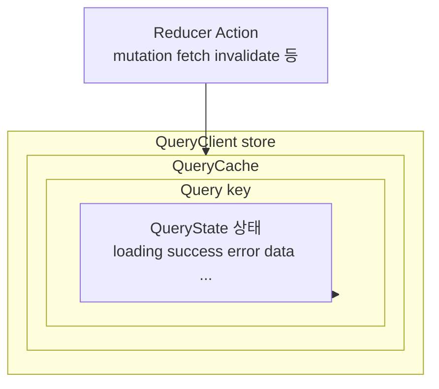
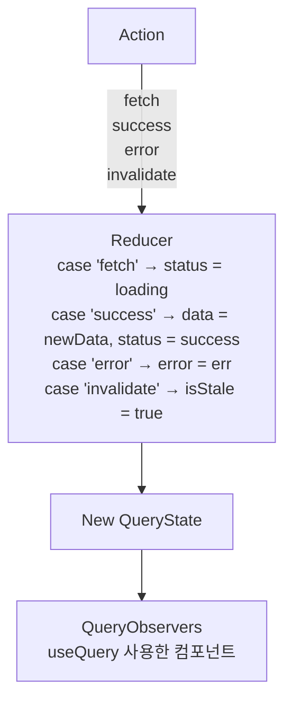
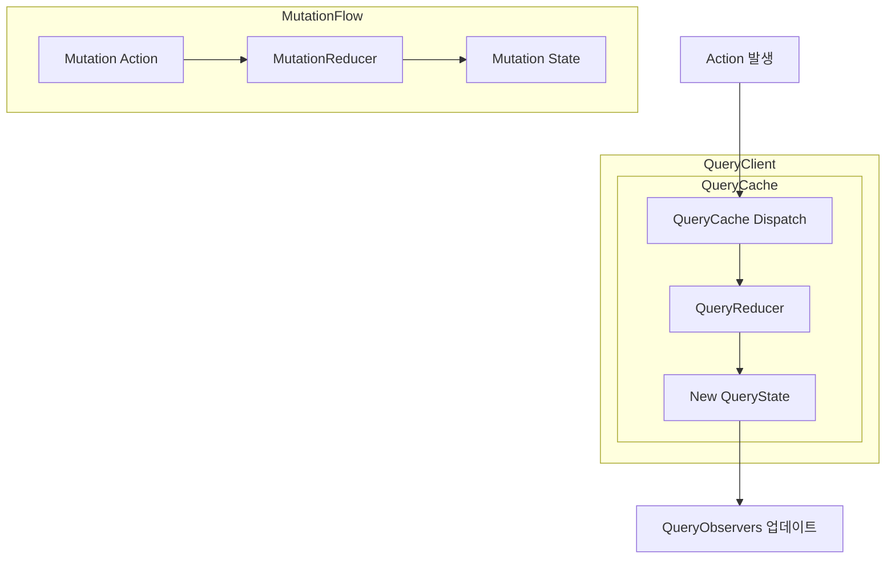

### React Query 내부 Reducer 구조

서버 상태 전이를 관리하는 내부 메커니즘

---

### 개념 요약

React Query는 단순한 비동기 요청 라이브러리가 아니라,
**Reducer 기반의 상태 전이 모델을 가진 “서버 상태 관리 시스템”이다.**

겉으로는 `useQuery`, `useMutation`으로 쉽게 보이지만
내부 엔진은 `Action → Reducer → QueryState 업데이트` 구조를 따른다.

---

### 전체 구조 요약

React Query 내부는 아래 계층 구조로 정리할 수 있다.



Reducer 모델을 기반으로 하지만,
여기에 캐싱·리패칭·stale 시간 계산 등이 추가된 확장판이라고 보면 된다.

---

### QueryClient / QueryCache / QueryState 구조

React Query는 서버 상태를 아래와 같이 보관한다.

* **QueryClient**: 전체 상태 관리자
* **QueryCache**: Query(key) 별 상태 저장소
* **QueryState**: 각 쿼리의 현재 상태
  (loading / success / error / data / fetchStatus …)

이 구조는 사실상 Redux store와 거의 동일한 형태다.

---

### Action → Reducer → State 흐름

React Query 내부에는 다음과 같은 액션들이 존재한다.

예시 액션:

* fetch
* success
* error
* invalidate
  등…

액션이 발생하면 QueryReducer가 이를 처리해 QueryState를 갱신한다.



이후 변경된 상태는 구독 중인 컴포넌트(useQuery)로 전달된다.

---

### QueryCache 내부 구조

QueryCache는 key별 Query 객체를 가진다.

```
QueryCache
├── Query(["posts"])
│     └── QueryState { status, data, error ... }
│
├── Query(["posts", page])
│     └── QueryState { status, data, error ... }
│
└── Query(["user", id])
      └── QueryState { ... }
```

각 Query는 독립적인 Reducer에 의해 상태가 관리된다.

---

### QueryReducer와 MutationReducer

React Query는 두 개의 reducer 흐름을 갖는다.

1. **QueryReducer**
   → fetch, success, error 등 QueryState 업데이트 담당

2. **MutationReducer**
   → mutation 진행 상태(pending, success, error 등) 담당

구조는 아래와 같다.

```
QueryClient
│
├── QueryCache
│     │
│     ├── dispatch(action)
│     │      │
│     │      ▼
│     │   QueryReducer(currentState, action) → newState
│     │
│     └── notify()
│
└── MutationCache
      │
      └── mutationReducer()
```

---

### 낙관적 업데이트에서의 Reducer 동작

낙관적 업데이트는 다음 흐름을 따른다.

```
onMutate() 발생
      │
      ▼
setQueryData() → 캐시에 임시 optimistic 데이터 저장
      │
      ▼
Reducer → 새 QueryState 생성
      │
      ▼
컴포넌트 즉시 업데이트
      │
      ▼
서버 응답 도착
      │
   success? error?
      │
      ▼
Reducer에서 "success" or "error" 액션 처리
      │
      ▼
invalidate() → stale 상태 → refetch

```

여기서도 핵심은 Reducer가 상태 전이를 수행한다는 점이다.

---

### React Query 내부 reducer 구조




---

### 정리

* React Query는 내부적으로 “Reducer 기반 상태 전이 모델”을 사용한다.
* QueryState는 QueryReducer 액션 처리 결과로 결정된다.
* 낙관적 업데이트 또한 Reducer 모델 위에서 동작한다.
* QueryClient / QueryCache / QueryState 구조는 Redux store와 유사하다.
* React Query는 “Reducer + 캐싱 + 동기화” 기능이 결합된 고급 서버 상태 관리 시스템이다.
