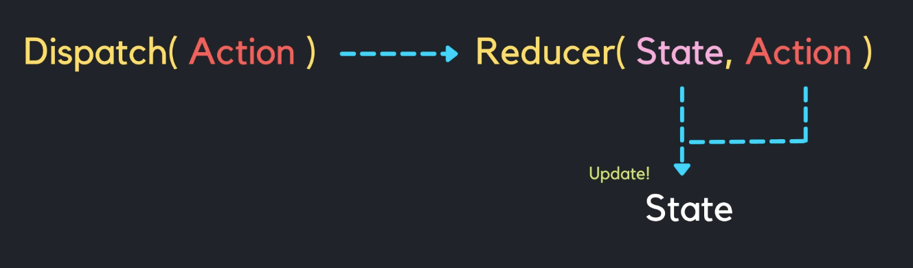

# Reducer

---

**“행동에 따라 상태가 어떻게 변해야 하는지** 정의한 상태 변경 규칙 모음집”

## 💡 사용 이유

기본적으로 컴포넌트 상태는 useState로 관리한다.

하지만 **기능이 늘어나고 상태 변경 로직이 복잡해지면 useState만으로는 한계가 생긴다.**

→ 이때 등장하는 것이 **Reducer 패턴(useReducer)**

### 왜 useState 만으로 부족할까

useState는 값 중심이다.

- 값을 setState가 변경해줌.
- 상태 갯수가 적고, 서로 연관이 없을때는 매우 좋습니다!

**반대로→ 상태 갯수가 많고 서로 연관성이 높을때는 Reducer를 사용해야한다!**

예시 : 게시판 기능 확장

- 제목
- 내용
- 작성자
- 태그
- 정렬 방식
- 필터 조건
- 로딩 여부
- 에러 여부

→ 서로 연관된 상태들이 많아지면 setState가 여기저기 흩어져서 유지보수가 어렵다.

→ 어떤 액션이 발생했을 때 **전체 상태를 한번에 확인**하고 싶다.

**—>> Reducer가 해결해 줄꺼야!**

---

## 💡 특징 및 동작 원리

<aside>

만원 : state, 출금 : action

만원을 출금해줘. : Dispatch

만원 출금 주체 : Reducer

</aside>

- **Action : 명령하는 내용 : 만원**을 출금해주세요
- **Dispatch : 요구** : **(Action : 내용)**“**만원**을 출금해주세요” : **명령 action을 전달**
- **Reducer** : “통장(값)에서 만원을 출금해줄께요” : **변환기 : 변환하는 주체**
- **State** : “값”에서 만원 (target)



### useReducer의 핵심 원리

- **state와 action을 받아서 newState**를 반환한다.
    - 이 사이에 **dispatch(action을 전달함), Reducer(변환하는 주체)**가 존재한다.

```jsx
(state, action) => newState
```

### reduce() 함수로 직관적으로 이해하기

```jsx
const numbers = [1, 2, 3, 4, 5];
const sum = numbers.reduce((acc, cur) => acc + cur, 0);
// 15
```

- acc = 이전값
- cur = 현재값
- acc + cur = 새로운 값

→ React의 useReducer도 동일 원리

```
(state, action) => newState
```

## Reducer 작성 시 반드시 지켜야 할 규칙

(1) **순수함수여야 한다**

(2) **부수효과(side effect) 금지**

(3) **불변성을 지켜야 한다**

## useReducer와 useState의 차이

<aside>
💡

- useState → 값 중심 **(state)**
- useReducer → “무 엇을 할 것인지” 중심**(action)**
</aside>