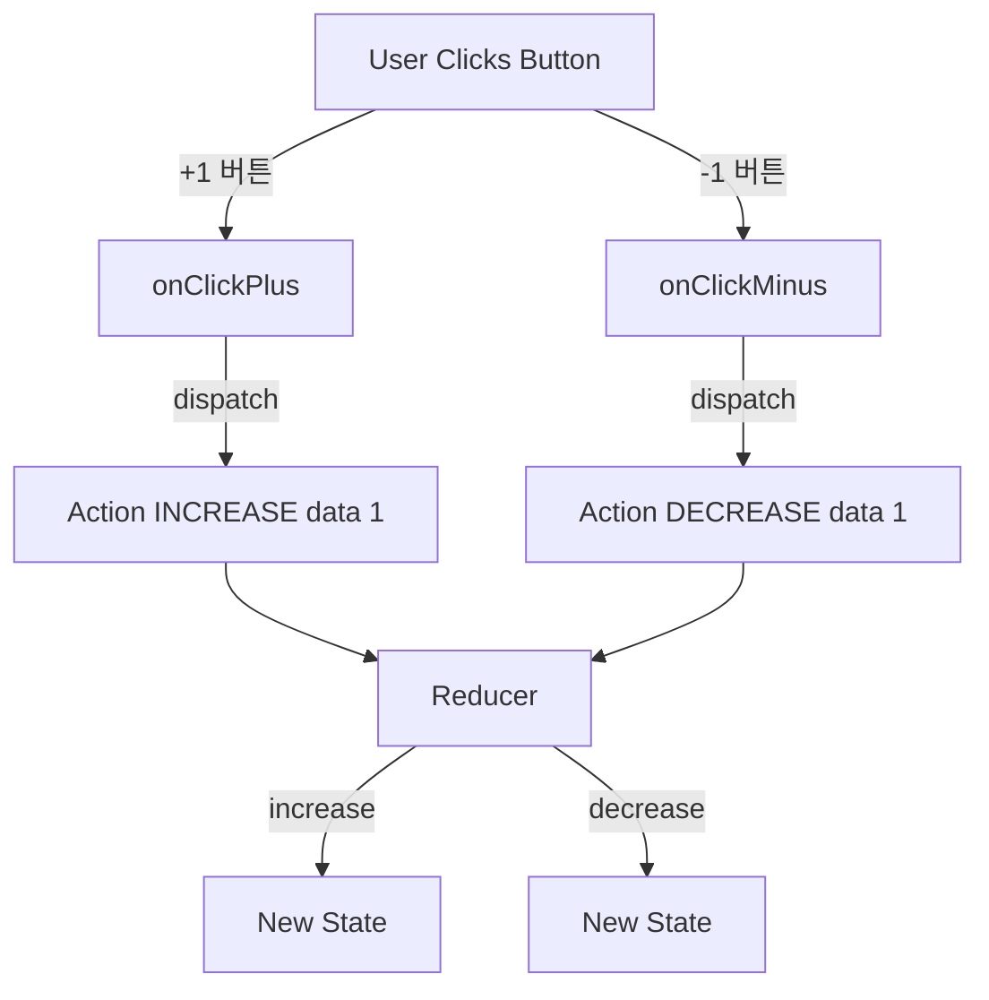

## 💡 특징 및 동작 원리

```jsx
const [state, dispatch] = useReducer(reducer, initialState);
```

- **useReducer의 구성 요소**
    - **state** : 현재 상태값
    - **dispatch(action)** : action을 reducer에게 발송하는 함수
        - 상태 변화가 있어야한다는 사실을 알리는 함수 : 상태 변화의 명령함수
    - **reducer** : action 변환 시키는 함수 : 주체
        - 상태(state)를 실제로 변환시키는 변환기 역할

---

## Reducer의 핵심 역할

### **액션(action)에 따라 state를 어떻게 바꿀지 결정하는 함수**

- 보통 reducer 안에 **switch > if else**를 많이 쓴다.

```jsx
function reducer(state, action) {
  switch (action.type) {
    case "INCREASE":
      return state + action.data;
    case "DECREASE":
      return state - action.data;
    default:
      return state;
  }
}
```

- 입금이면 → 더하기
- 출금이면 → 빼기

---

## Reducer의 요소 살펴보기

전체 코드

```jsx
function reducer(state, action) {
  switch (action.type) {
    case "INCREASE":
      return state + action.data;
    case "DECREASE":
      return state - action.data;
    default:
      return state;
  }
}

const Exam = () => {
  const [state, dispatch] = useReducer(reducer, 0);

  const onClickPlus = () => {
    dispatch({
      type: "INCREASE",
      data: 1,
    });
  };

  const onClickMinus = () => {
    dispatch({
      type: "DECREASE",
      data: 1,
    });
  };
  
  return (
    <div>
      <h1>{state}</h1>
      <button onClick={onClickPlus}>+1</button>
      <button onClick={onClickMinus}>-1</button>
    </div>
  );
};
```

### useReducer

```jsx
const [state, dispatch] = useReducer(reducer, 0);
```

- useHook처럼 동일하게 작성한다.
- **state :** 현재 상태를 저장하는 저장소
- **dispatch** : action을 reducer에게 전달한다.

### dispatch

- 역할 : dispatch는 인수를 **reducer에게 전달**하는 역할이다.
- 인수 : 상태를 어떻게 변화되길 원하는지

  → 인수로 전달된 객체 : action

  **action = { type, data }**


→ useReducer를 작성하고 dispatch를 사용하면 거의 로직을 수행해야한다.

```jsx
  const onClickPlus = () => {
    dispatch({
      type: "INCREASE",
      data: 1,
    });
  };
```

### reducer

- 역할 : dispatch로 부터 받은 **action을 처리하는 로직을 수행하는 역할**이다.
- **state :** 현재 상태값
- **action :** dispatch에게 전달받은 action

```jsx
function reducer(state, action) {
  switch (action.type) {
    case "INCREASE":
      return state + action.data;
    case "DECREASE":
      return state - action.data;
    default:
      return state;
  }
}
```

### useReducer 코드 플로우



---

## useState 버전

- **변경 로직이 분산되어있다.**
    - setState((prev) => prev + 1);
      setState((prev) => prev - 1);
    - 로직이 모두 다른 함수에서 처리한다.

```jsx
const Exam = () => {
  const [state, setState] = useState(0);

  const onClickPlus = () => {
    setState((prev) => prev + 1);
  };

  const onClickMinus = () => {
    setState((prev) => prev - 1);
  };

  return (
    <div>
      <h1>{state}</h1>
      <button onClick={onClickPlus}>+1</button>
      <button onClick={onClickMinus}>-1</button>
    </div>
  );
};
```

→ useReducer는 reducer에서 로직을 모두 책임지고 있음.

---

### 정리

**Reducer란 상태 변경 로직**을 **하나에서 모아 관리한다. : reducer의 철학**

```
(state, action) => newState
```

- state: 현재 상태
- action: 어떤 변경을 원하는지 설명하는 객체
- newState: 변경 후 상태

Redux, Zustand 같은 전역 상태 라이브러리도 **이 패턴이 핵심 원리**다.

---

- 별코딩 은행 코드
    - **액션 타입 정리**

    ```tsx
    const ACTIONS = {
      DEPOSIT: "deposit",
      WITHDRAW: "withdraw",
    };
    ```

    - reducer 함수

    ```tsx
    function reducer(balance, action) {
      console.log("Reducer 실행:", balance, action);
    
      const amount = Number(action.payload) || 0; // NaN 방지
      const current = Number(balance) || 0;
    
      switch (action.type) {
        case ACTIONS.DEPOSIT:
          return current + amount;
    
        case ACTIONS.WITHDRAW:
          return current - amount;
    
        default:
          return current;
      }
    }
    ```

    - 전체 컴포넌트

    ```tsx
    export function Test() {
      const [inputValue, setInputValue] = useState(0); // 입금/출금 입력 값
      const [balance, dispatch] = useReducer(reducer, 0); // 잔고 state
    
      const handleChange = (e) => {
        const value = Number(e.target.value) || 0;
        setInputValue(value);
      };
    
      return (
        <div>
          <p>💰 현재 잔고: {balance}</p>
    
          <input
            type="number"
            value={inputValue}
            onChange={handleChange}
            step="1000"
          />
    
          <button
            onClick={() =>
              dispatch({ type: ACTIONS.DEPOSIT, payload: inputValue })
            }
          >
            예금
          </button>
    
          <button
            onClick={() =>
              dispatch({ type: ACTIONS.WITHDRAW, payload: inputValue })
            }
          >
            출금
          </button>
        </div>
      );
    }
    ```