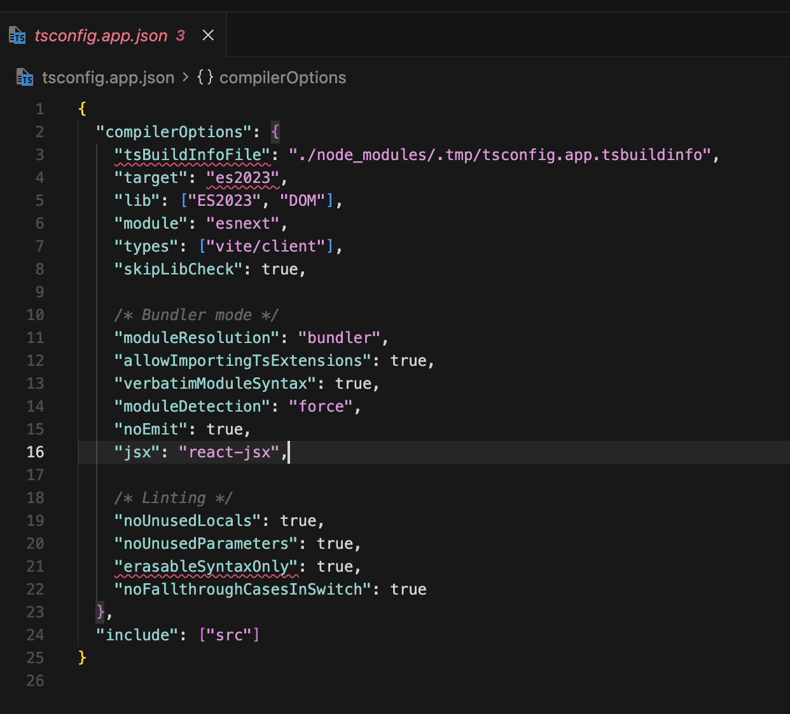

# [VS Code / TypeScript] tsconfig 옵션에 빨간 줄이 표시된 이유

## 발생 환경

- Vite + React + TypeScript 프로젝트
- 프로젝트 TypeScript: `5.5.3`
- VS Code TypeScript 언어 서비스: 프로젝트보다 낮은 버전
- 문제 파일: `tsconfig.app.json`

## 문제 상황

프로젝트 빌드는 가능했지만 VS Code에서 `tsconfig.app.json`의 일부 옵션에
빨간 줄이 표시됐다.



문제가 표시된 설정은 다음과 같았다.

```json
{
  "compilerOptions": {
    "tsBuildInfoFile": "./node_modules/.tmp/tsconfig.app.tsbuildinfo",
    "target": "es2023",
    "erasableSyntaxOnly": true
  }
}
```

## 원인

프로젝트에 설치된 TypeScript와 VS Code가 IntelliSense에 사용한 TypeScript
언어 서비스의 버전이 달랐다.

VS Code는 자체 내장 TypeScript를 사용할 수 있고, 프로젝트는
`node_modules/typescript`에 설치된 별도 버전을 사용할 수 있다. 따라서 터미널의
빌드 결과와 에디터 진단이 서로 다를 수 있다.

특히 `erasableSyntaxOnly`는 함수가 아니라 **TypeScript 5.8에서 도입된 compiler
option**이다. VS Code가 5.8보다 낮은 버전을 사용하면 이 옵션을 알 수 없으므로
`Unknown compiler option 'erasableSyntaxOnly'` 오류가 발생한다.

## 버전별 재현

동일한 `tsconfig.app.json`을 서로 다른 TypeScript 버전으로 검사했다.

```bash
npx -p typescript@5.3.3 tsc -p tsconfig.app.json --noEmit
npx -p typescript@5.5.4 tsc -p tsconfig.app.json --noEmit
npx -p typescript@5.8.3 tsc -p tsconfig.app.json --noEmit
```

### TypeScript 5.3

```text
TS5069: 'tsBuildInfoFile' requires 'incremental' or 'composite'
TS6046: 'es2023' is not a valid target
TS5023: Unknown compiler option 'erasableSyntaxOnly'
```

### TypeScript 5.5

`es2023`은 인식하지만 `erasableSyntaxOnly`는 여전히 인식하지 못했다.

```text
TS5069: 'tsBuildInfoFile' requires 'incremental' or 'composite'
TS5023: Unknown compiler option 'erasableSyntaxOnly'
```

### TypeScript 5.8

동일한 설정으로 검사를 통과했다.

즉, 이번 설정 전체를 정상적으로 해석하려면 단순히 5.5 이상이 아니라
**최소 TypeScript 5.8이 필요했다.**

## 해결 과정

1. VS Code에서 TypeScript 파일을 하나 연다.
2. 명령 팔레트에서 `TypeScript: Select TypeScript Version`을 실행한다.
3. `Use Workspace Version`을 선택한다.
4. 상태 표시줄에서 프로젝트의 TypeScript 버전이 선택됐는지 확인한다.
5. 필요하면 `TypeScript: Restart TS Server`를 실행한다.

워크스페이스 설정으로 TypeScript 경로를 명시할 수도 있다.

```json
{
  "js/ts.tsdk.path": "./node_modules/typescript/lib"
}
```

이 설정은 프로젝트 TypeScript의 위치를 VS Code에 알려준다. 실제 언어 서비스
전환을 위해서는 `TypeScript: Select TypeScript Version`에서 워크스페이스 버전도
선택해야 한다.

## 검증 결과

- VS Code의 TypeScript 버전을 워크스페이스 버전으로 변경했다.
- `tsconfig.app.json`의 빨간 줄이 사라졌다.
- TypeScript 5.8 이상에서 동일 설정의 컴파일 검사가 통과했다.

## 배운 점

- 에디터의 TypeScript 언어 서비스와 프로젝트의 `tsc`는 서로 다른 버전을 사용할
  수 있다.
- 빌드는 성공하지만 에디터에만 오류가 표시되면 활성 TypeScript 버전을 먼저
  확인해야 한다.
- 새로운 `tsconfig` 옵션을 발견하면 함수나 문법으로 추측하지 말고 도입된
  TypeScript 버전을 공식 문서에서 확인해야 한다.
- 팀 프로젝트에서는 워크스페이스 TypeScript를 사용해 에디터와 CI의 진단 기준을
  맞추는 것이 안전하다.

## 참고

- [TypeScript 5.8: erasableSyntaxOnly](https://www.typescriptlang.org/docs/handbook/release-notes/typescript-5-8.html)
- [VS Code: Using the workspace version of TypeScript](https://code.visualstudio.com/docs/typescript/typescript-transpiling#_using-the-workspace-version-of-typescript)
- [TypeScript TSConfig Reference](https://www.typescriptlang.org/tsconfig/)
