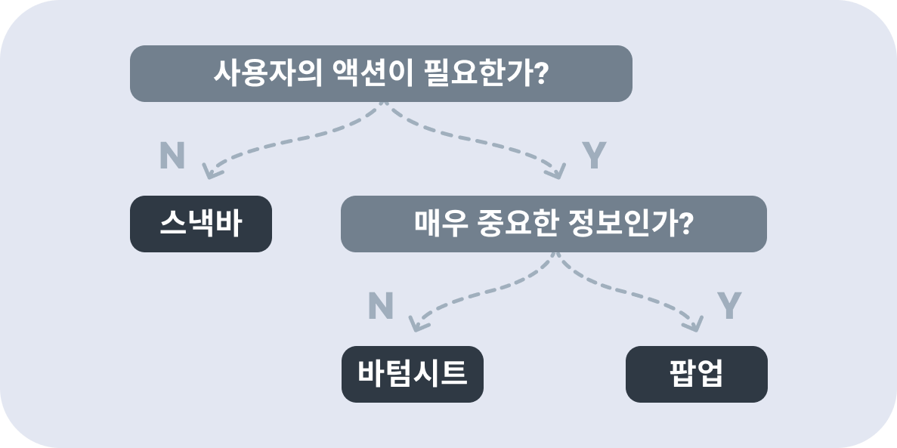
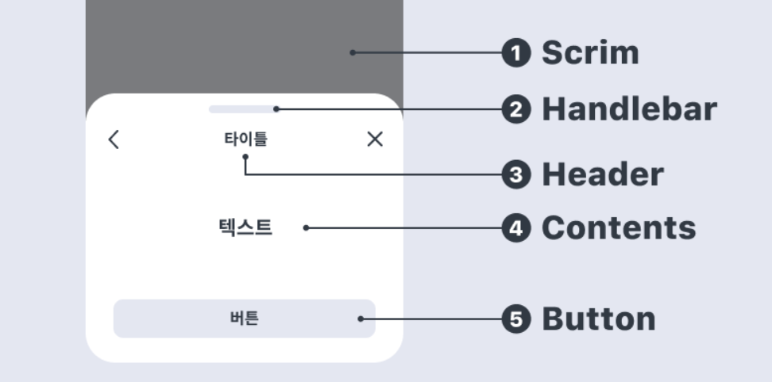
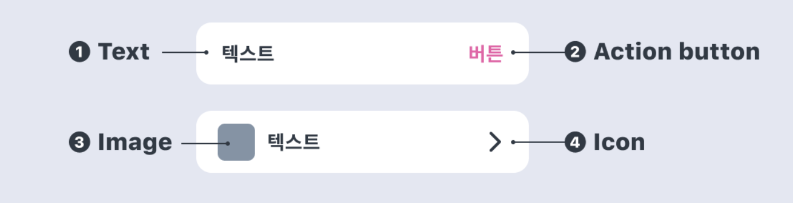
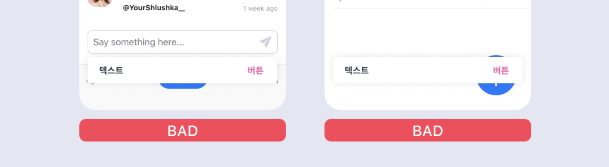

## 모달 UI

모달UI란? 사용자의 이목을 끌기 위해 사용하는 화면전환 기법

**즉, 사용자의 현재 작업 흐름을 ‘의도적으로 중단’시키고
즉각적인 판단·행동을 요구하는 UI 패턴**

- 스낵바
- 팝업
- 바텀 시트

→ 모두 모달 UI라고 부름

모달의 특징

- 흐름 차단
- 강제성
- 문맥 보존

---

## 모달 UI의 사용 기준

### 팝업(popup)

사용하는 상황

1. 중요한 정보 전달
    1. 사용자에게 작업에 대한 내용을 확인시키기 위해
2. 사용자의 선택을 기다려야할 때
    1. 사용자가 정보입력을 해야할 경우
    2. 승인을 해야할때

**팝업 구성요소**

- Scrim(뒤에 깔리는 오버레이 배경)
- Content
- Button

**팝업 주의사항**

1. 팝업 사용을 최소화해야함.
    - 사용자의 결정이 이뤄질때까지 앱의 모든 기능이 비활성화된다.
    - 팝업은 의도적으로 사용자를 방해하며, 피로감을 줄 수 있다. (귀찮음)
2. 간단한 작업을 전달한다.
    - 현재 화면에 벗어나지 않고 액션을 취해야하기 때문에
3. 설명이 간단해야함.
    - 어떤 액션인지 바로 인지할 수 있어야한다.
    - **팝업 버튼 문구는 직관적이어야한다.**

---

### 바텀 시트(Bottom Sheet)

**사용 상황**

1. 기존 화면과 관련된 콘텐츠를 제공해야할 때
2. 메뉴 제공

**바텀 시트 구성요소**

- Scrim
- Handlebar
    - with Handlebar
        - 확장이 가능함.
    - without Handlebar
        - 확장 불가능
- Header
    - Navigating Bar, Search Bar 등 활용 가능
- Contents
- Button

**바텀 시트 종류**

- 논모달 : scrim이 존재하지 않음
- 모달 : scrim이 존재

---

### 스낵바(Snack Bar)

= Toasts

- 수행한 액션에 대한 피드백을 줌

**스낵바 구성요소**

- Text
- Action
- Image
- Icon

**스낵바 주의사항**

- 위치 주의사항
    - 바텀 네비, 플로팅 액션 버튼 등 중요도가 높은 컴포넌트를 가리지 않도록 주의
    - 최대한 짧은 메시지로 구성한다
        - 제한된 시간이 지나면 사라지기 때문
    - 콘텐츠가 중요한 내용이라면 스낵바 보다는 팝업으로 표시한다.

### 팝업/ 바텀시트 / 스낵바 정리

---

- **팝업 :** 중요한 정보를 전달할때 사용하며 사용자의 액션을 방해하기 때문에 사용을 최소화한다.
- **바텀 시트 :** 기존 화면과 연관된 기능 또는 여러 메뉴를 제공해야할 때 사용한다.
- **스낵바 :** 사용자 액션에 대한 피드백 제공.
    - 액션을 줄수도 있다.

---

모달 종류

| 유형 | 목적 | 특징 |
| --- | --- | --- |
| Alert Modal | 정보 전달 | **선택지 거의 없음** |
| Confirm Modal | 파괴적 행동 확인 | **삭제, 로그아웃** |
| Form Modal | 짧은 입력 | **설정 변경** |
| Blocking Modal | 필수 동의 | 서비스 진입 전 |
| Non-modal 대안 | 흐름 유지 | Drawer, Sheet |

---
이미지 및 스터디 참고

https://yozm.wishket.com/magazine/detail/1272/
