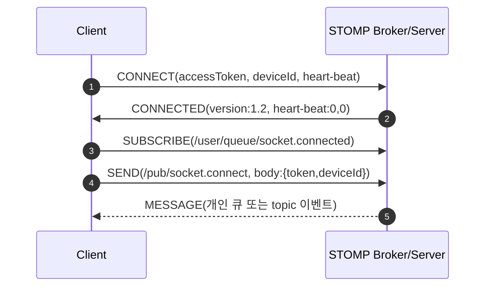

## 개념 정의
이 문서는 WebSocket 연결 직후 수집된 STOMP 프레임 로그를 실제 세션 관점에서 해석하는 TIL이다.  
핵심 목적은 `CONNECT -> CONNECTED -> SUBSCRIBE -> SEND -> MESSAGE` 흐름이 각각 무엇을 의미하는지, 그리고 어떤 시점에서 인증과 세션 성립이 완료되는지를 정확히 구분하는 것이다.  
로그를 단계별로 읽을 수 있으면, 나중에 `pending`, `unauthorized`, `구독은 됐는데 메시지가 안 옴` 같은 문제를 빠르게 분해할 수 있다.  
즉 이 정리는 프로토콜 이론 설명이 아니라, 지금 관찰한 실제 프레임을 근거로 현재 연결 상태를 판정하는 실전 해석 가이드이다.

## 동작 원리
1. 클라이언트가 STOMP `CONNECT` 프레임을 보내며 세션 시작 의사와 인증 정보를 전달한다.  
2. 서버가 `CONNECTED` 프레임을 돌려주면 STOMP 세션은 승인 상태가 되고, 이 시점에서 WebSocket과 STOMP 양쪽 연결이 모두 성립한다.  
3. 클라이언트는 `SUBSCRIBE`로 수신 채널을 등록하고, 등록된 destination으로 브로커가 `MESSAGE`를 전달할 수 있는 상태가 된다.  
4. 클라이언트는 `SEND`로 서버 애플리케이션 목적지(`/pub/**`, `/app/**` 등)에 비즈니스 이벤트를 발행한다.  
5. 서버는 메시지 매핑 로직을 실행한 뒤 필요한 경우 topic/queue로 fan-out 하며, 구독자가 있으면 `MESSAGE` 프레임이 돌아온다.

여기서 깨달은 점은 `CONNECTED` 한 줄이 단순 응답이 아니라 “라우팅 문제를 통과하고 인증까지 끝난 상태”를 증명하는 결정적 증거라는 사실이다.

아래는 이번 로그를 프레임별로 해석한 표이다.

| 프레임 | 방향 | 핵심 헤더 | 해석 |
| --- | --- | --- | --- |
| `CONNECT` | Client -> Server | `accessToken`, `deviceId`, `accept-version`, `heart-beat` | STOMP 세션 시작 요청 + 인증 컨텍스트 전달 단계이다. |
| `CONNECTED` | Server -> Client | `version:1.2`, `heart-beat:0,0` | 세션 승인 단계이며, STOMP 협상 완료 상태이다. |
| `SUBSCRIBE` | Client -> Server | `id:sub-0`, `destination:/user/queue/socket.connected` | 개인 큐 수신 등록 단계이다. |
| `SEND` | Client -> Server | `destination:/pub/socket.connect`, JSON body | 연결 완료 이벤트를 서버 비즈니스 로직으로 전달하는 단계이다. |
| `MESSAGE` | Server -> Client | `subscription`, `destination`, `message-id` | 구독 중인 destination으로 실제 데이터가 전달되는 수신 단계이다. |

### CONNECT 프레임 해석

```text
CONNECT
accessToken:Bearer eyJhbGciOiJIUzI1NiJ9...
deviceId:cfc8e4af-f7d7-4f68-8b74-dd582cc45409
accept-version:1.2,1.1,1.0
heart-beat:10000,10000
```

- `accessToken`은 인증/인가 체크 입력값이다.  
- `deviceId`는 클라이언트 식별, 중복 세션 통제, 감사 로그 식별 등에 쓰이는 값이다.  
- `accept-version`은 클라이언트 지원 STOMP 버전 목록이며, 서버와 협상된다.  
- `heart-beat:10000,10000`은 클라이언트 관점에서 송신/수신 최소 주기를 제안하는 값이다.

### CONNECTED 프레임 해석

```text
CONNECTED
version:1.2
heart-beat:0,0
```

- `version:1.2`는 최종 협상 버전이 STOMP 1.2임을 의미한다.  
- `heart-beat:0,0`은 서버가 heartbeat를 송신/요구하지 않는 정책임을 의미한다.  
- 이 프레임이 존재하면 최소한 “WebSocket 연결 실패”나 “초기 인증 즉시 실패” 상태는 아니라는 판단이 가능하다.

### SUBSCRIBE 프레임 해석

```text
SUBSCRIBE
id:sub-0
destination:/user/queue/socket.connected
```

- `/user/queue/**`는 Spring STOMP에서 보통 사용자 전용 큐로 라우팅되는 목적지이다.  
- `id`는 클라이언트 내부 구독 식별자이며, 나중에 `UNSUBSCRIBE`할 때 기준 키로 사용된다.  
- 즉 이 프레임은 “연결 성공 알림 또는 개인 상태 이벤트를 받기 위한 초기 구독 등록”으로 해석된다.

### SEND 프레임 해석

```text
SEND
destination:/pub/socket.connect
content-length:356

{"accessToken":"Bearer ...","deviceId":"..."}
```

- `/pub/socket.connect`는 서버 메시지 매핑 엔드포인트와 연결되는 애플리케이션 목적지이다.  
- 일반적으로 Spring에서는 `@MessageMapping("/socket.connect")`로 처리되는 형태이다.  
- CONNECT에서 이미 인증했더라도 SEND body에 토큰을 다시 넣는 구조는 비즈니스 이벤트 처리 계층에서 재검증하거나 컨텍스트를 복원하기 위한 설계일 수 있다.

### MESSAGE 프레임 해석

```text
MESSAGE
subscription:sub-0
message-id:msg-001
destination:/user/queue/socket.connected
content-type:application/json

{"type":"SOCKET_CONNECTED","status":"OK"}\0
```

- `MESSAGE`는 브로커/서버가 클라이언트로 push하는 실제 수신 프레임이다.  
- `subscription`은 어떤 구독 요청(`SUBSCRIBE id`)에 대한 메시지인지 식별하는 값이다.  
- `destination`은 메시지가 도착한 채널 주소이며, 클라이언트 라우팅/핸들러 분기 기준으로 사용된다.  
- `message-id`는 중복 처리나 로그 추적 시 유용한 식별자이다.

## 코드


```text
# 채팅방 /topic/chat/1을 구독할 때의 예시
SUBSCRIBE
id:sub-chat-1
destination:/topic/chat/1

\0
```

```text
# 채팅 메시지를 발행할 때의 예시
SEND
destination:/pub/chat.send
content-type:application/json

{"roomId":1,"message":"hello"}\0
```

위 시퀀스 다이어그램은 이번 로그에서 확인된 프레임 순서를 브로커 기준으로 시각화한 것이다.  
첫 번째 텍스트 프레임은 질문한 “그럼 채팅방 구독 프레임은 어떻게 생기나”에 대한 정답 예시이다.  
두 번째 텍스트 프레임은 구독 이후 실제 채팅 발행이 어떤 destination으로 흐르는지 보여주는 최소 동작 예시이다.

## 언제 쓰는지
- WebSocket은 열렸는데 실제로 STOMP 세션이 열린 것인지 판별해야 할 때 사용한다.  
- `CONNECTED`가 없거나 `SUBSCRIBE` 이후 `MESSAGE`가 오지 않을 때, 어느 단계에서 막혔는지 역추적할 때 사용한다.  
- 프론트 로그와 백엔드 로그를 맞춰보며 인증 문제인지 라우팅 문제인지 분리 진단할 때 기준 문서로 사용한다.  
- 다만 destination 규칙(`/pub`, `/topic`, `/user/queue`)은 프로젝트마다 다를 수 있으므로 서버 매핑 코드를 함께 확인해야 한다.

## 핵심 한 줄
STOMP 로그 해석의 핵심은 `CONNECTED`로 세션 성립을 확인하고, 그 다음 `SUBSCRIBE`와 `SEND`를 수신 경로와 발행 경로로 분리해서 읽는 것이다.
